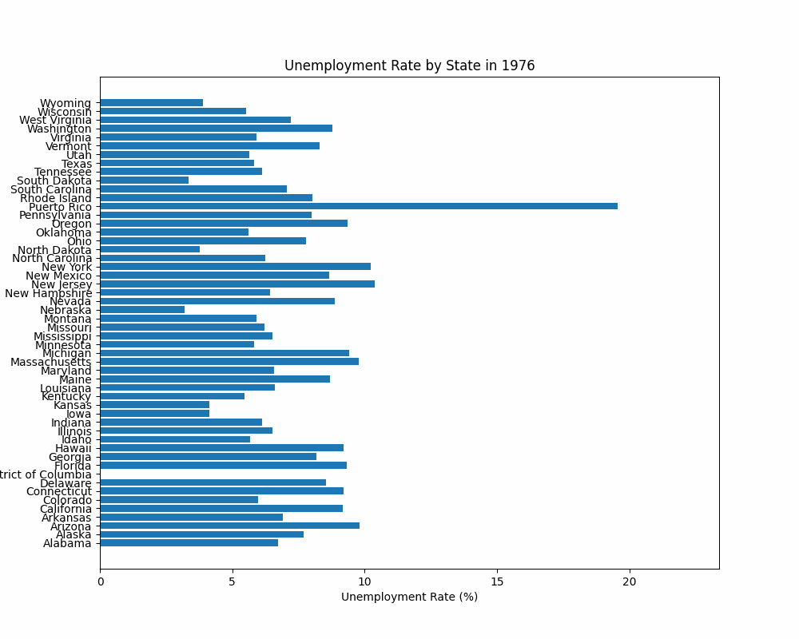
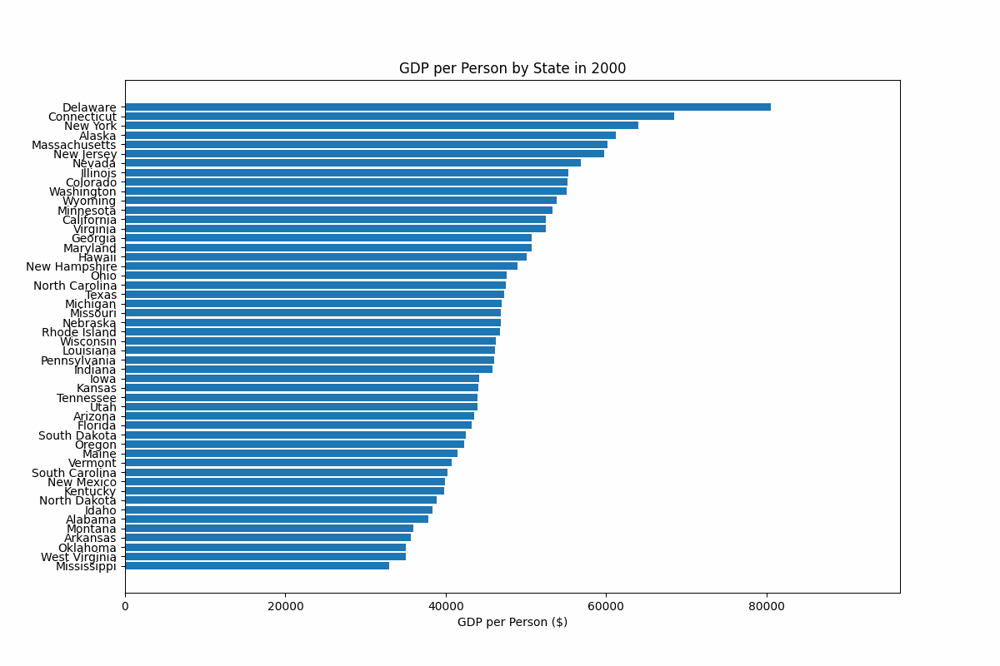
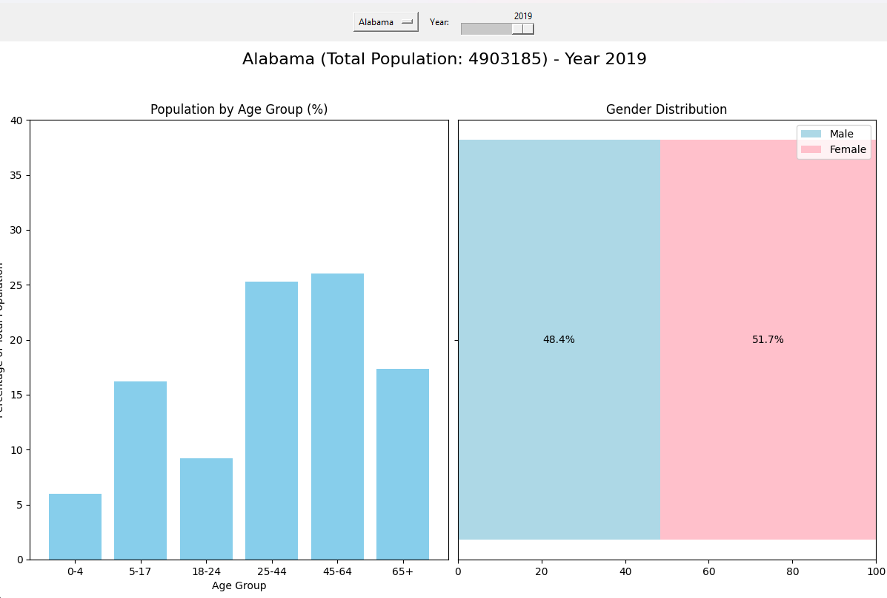
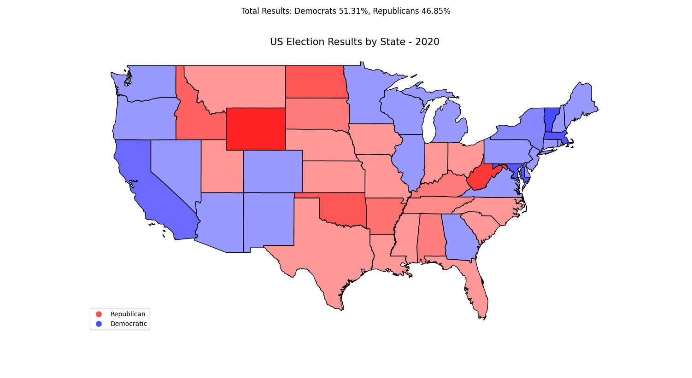
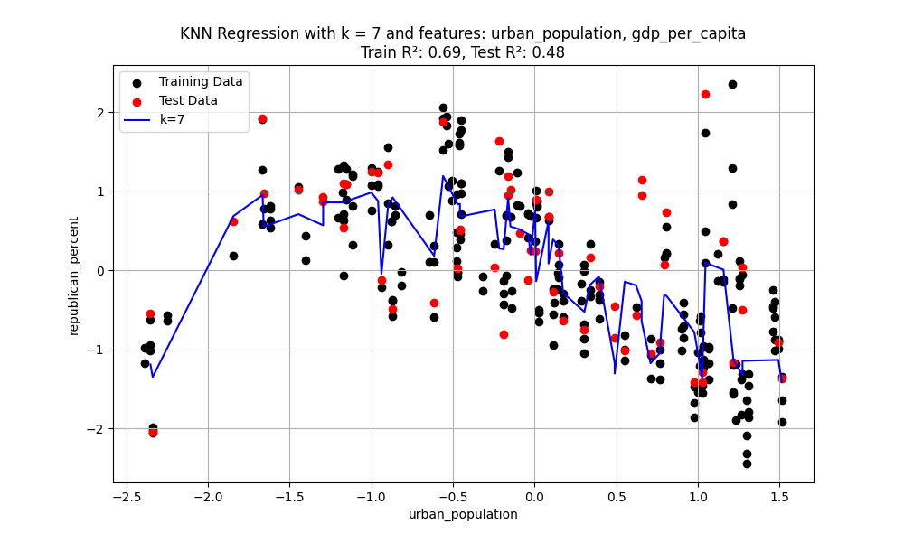
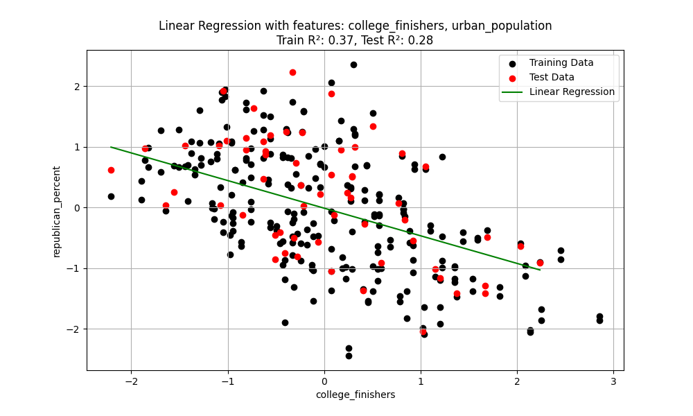
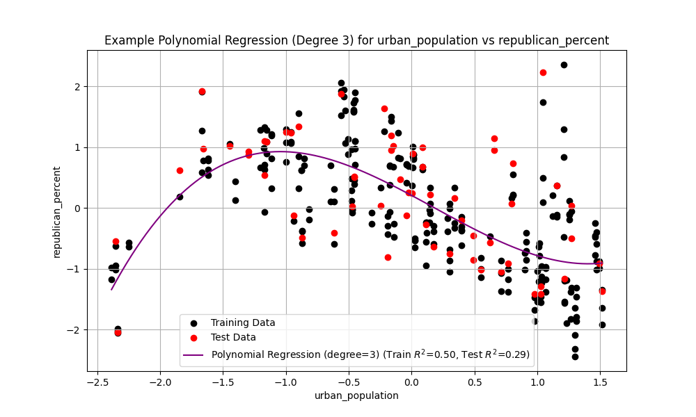

# Data Analysis Project

## Project Overview

This project is designed to practice data handling and analysis, focusing on various economic and social factors and their potential relationships with election results across the United States. The dataset includes information on unemployment, GDP, population statistics, education, urbanization, and election results from all states spanning many years.

## Objectives

1. **Data Collection and Importing**: Gather data from various sources and import it for analysis.
2. **Data Verification**: Ensure the data is consistent and accurate.
3. **Data Visualization**: Create visual representations of the data using various types of charts
4. **Data Analysis**: Analyze the data to identify potential relationships between economic and social factors and election results, particularly presidential election outcomes.

## Data Collection

The dataset includes:
- Unemployment rates
- GDP Data
- College graduation rates
- Population statistics
- Urbanization levels
- Election results (Presidential elections from 2000-2020)

Data was collected from multiple sources for a comprehensive dataset for analysis. However, I do not guarantee that all this data is correct and I did not check for correctness, since this was not the main goal of this project.

## Data Importing

The data was imported using Python scripts. Key steps included:
- Loading data from CSV, Excel and Text files
- Preprocessing data to handle missing values and inconsistencies

## Data Verification

To ensure the accuracy of the data, several checks were performed:
- Consistency checks to verify that data values make sense
- Coverage to check, if there is Data missing for states and year
- Checking data types and formats

## Data Visualization

Various types of visualizations were created to understand the data better:

### Unemployment Rates

### Population Statistics

### Age and Sex

### Election Results

## Analysis and Results

The main goal of the analysis was to determine if there is a relationship between the economic and social data of each state and its presidential election results. Several techniques were employed:

### K-Nearest Neighbors (KNN)

For the implementation of the K-Nearest Neighbors (KNN) algorithm, I used a greedy feature selection method combined with a grid search for hyperparameter tuning. This approach iteratively selects features that improve the model's R-squared score, ensuring only the most impactful features are included in the final model. Cross-validation with a grid search is performed to determine the optimal number of neighbors (k) that maximizes the model's performance. This ensures both efficient feature selection and optimal tuning of the KNN regression model.

### Linear Regression

The approach for the linear regression is similar, using greedy feature selection and cross-validation. Features are iteratively added based on their contribution to improving the model's R-squared score, ensuring an optimal set of features and evaluation by the linear regression model.

### Polynomial Regression

The approach for polynomial regression is similar, using greedy feature selection combined with a grid search for the best polynomial degree. Features are iteratively selected based on their improvement of the model's R-squared score, ensuring optimal feature selection and degree determination for the polynomial regression model.

### Findings

The analysis showed that there's too much variation in the data to pinpoint a clear link between socio-economic factors and election outcomes. This means we would need a more targeted study of individual voter traits to get meaningful insights. Detailed data on things like political preferences (Democrat or Republican) at the individual level would help reduce this variation and improve prediction accuracy.

## Conclusion

This project provided insights into the complexities of analyzing social and economic data and its connection to election results. While I didn't reach any definitive conclusions, the process shows the importance of comprehensive data and the challenges of variance in large datasets.

